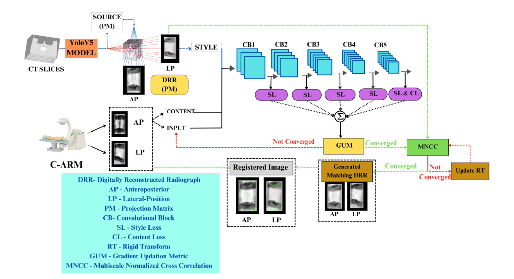

<h1 align="center">iVReg: Individual Vertebrae 2D/3D Registration between Fluoroscopic and CT images </h1>

<p  align="center">  
  
 Minimally Invasive Spine Surgery has become increasingly popular due to advancements in image-guided techniques, which provide surgeons with comprehensive views of the surgical area without extensive spine exposure. The proposed iVReg introduces a novel methodology for registering pre-operative `3D Computed Tomography` (CT) data with intra-operative 2D C-Arm fluoroscopic images through `2D-3D registration` using YOLOv5 for precise identification and cropping of individual vertebrae on CT. The C-Arm camera projection matrix is used for generating closely matching `Digitally Reconstructed Radiographs (DRRs)`, which greatly minimizes the chance of being stuck in local minima. The imaging attribute difference between the C-Arm and CT is handled using neural style transfer. The experimental results using iVReg demonstrate the efficacy of this approach in terms of registration accuracy compared to other existing methods.
</p>

<h3 > <i>Index Terms</i> </h3> 

 :diamond_shape_with_a_dot_inside:2D/3D Registration
  :diamond_shape_with_a_dot_inside: Surgical planning
  :diamond_shape_with_a_dot_inside:Digitally Reconstructed Radiographs
  :diamond_shape_with_a_dot_inside:Style Transfer
  :diamond_shape_with_a_dot_inside:YOLOv5
</div>


## <div align="center">Getting Started</div>

<details>
  <summary><i>DRR Generation</i></summary>


1. **CT Volume Processing**:
   - CT slices of a spine phantom are collected and stacked to create a 3D volume.
   - `Sagittal and coronal views` are generated from the volumetric data.

2. **Annotation and Training**:
   - Images are annotated using `makesense.ai`, labeling vertebral levels (L1, L2, L3, L4, L5).
   - Two YOLO-V5 models are trained: one for sagittal and another for coronal views.

3. **Bounding Box Prediction**:
   - The trained YOLO-V5 models predict bounding box coordinates for regions of interest in CT images.
   - These coordinates are used to crop the CT volume for focused visualization.

4. **DRR Generation**:
   - DRRs are generated using the DiffDRR module from the cropped `CT volume`.

</details>

<details open>
<summary><i>Neural Style Transfer</i></summary>
  
To address stylistic differences between DRR and X-ray images:
- The X-ray image is used as the content image.
- The DRR image is used as the style image.
- Neural style transfer is performed using VGG19 to maintain the content of the X-ray while incorporating the style of the DRR.

</details>

<details open>
<summary><i>Registration Process</i></summary>  
  
1. **Rigid Transformation**:
   - A rigid transformation is applied to align DRRs with X-ray images using translation and rotation parameters obtained from projection matrix.


2. **Optimization**:
   - Multi-Scaled normalized cross-correlation is used as the registration metric.
   - Various optimization techniques (`SGD, SGD with momentum, SGD with Dampening and Adam optimizer`) are employed to fine tune the registration process.


</details>

## <div align="center">Methodology</div>
<p align="center">
  
</p>

<div align = "center">
  
  :small_orange_diamond: Fig :Block diagram of proposed work.The module pipeline of iVReg incorporates YOLOv5,
C-Arm projection matrix, DRR generator, style transfer, and registration.
</div>


<p align="center">
  
</p>

<div align = "center">
  
  :small_orange_diamond: Fig :DRR generation from Lumbar Spine Phantom for AP and LP view positions.
The AP and LP source positions could be easily computed from the C-Arm projection
matrices
</div>


## <div align="center">Pre-requisites</div>
Before installing and running the project, ensure you have the following prerequisites:

 :grey_exclamation: Download and install Jupyter Notebook from the `Jupyter website`.
 
 :wavy_dash: The version for this project is **Jupyter Notebook 6.0.3**.
  
  :grey_exclamation: YOLOv5 

 
 :wavy_dash:  See the [YOLOv5 Docs](https://docs.ultralytics.com/yolov5) for full documentation on training, testing and deployment. See below for quickstart examples.
 
:grey_exclamation: DiffDRR

:wavy_dash: `DiffDRR` is a PyTorch-based digitally reconstructed radiograph (DRR) generator that provides

:small_orange_diamond:Differentiable X-ray rendering
:small_orange_diamond:GPU-accelerated synthesis and optimization
:small_orange_diamond:A pure Python implementation

To include DiffDRR in your project, follow these steps:

1. Download from the official [DiffDRR GitHub repository](https://github.com/eigenvivek/DiffDRR/blob/main/diffdrr/pose.py):

    ```bash
    git clone https://github.com/eigenvivek/DiffDRR/blob/main/diffdrr/pose.py
    cd eigen-git-mirror
  
    ```

2. Locate the `pose.py` file in the `diffdrr` directory:

    ```bash
    cd diffdrr
    ls pose.py
    ```

3. Include the DiffDRR directory in your project's include path. 


## <div align="center">Installation</div>
:arrow_right:Clone the Repository
```bash
git clone https://github.com/Deepa-Ramki/2D-3D-Registration.git
```

:arrow_right:Navigate to the Project Directory
```bash
cd 2D-3D-Registration
```
:arrow_right:Install Dependencies
```bash
pip install -r requirements.txt
```
## <div align="center">Environments</div>
<div align="center">
  <a href="https://jupyter.org/">
    </a>
  
  <a href="https://bit.ly/yolov5-paperspace-notebook">
    </a>
</div>
